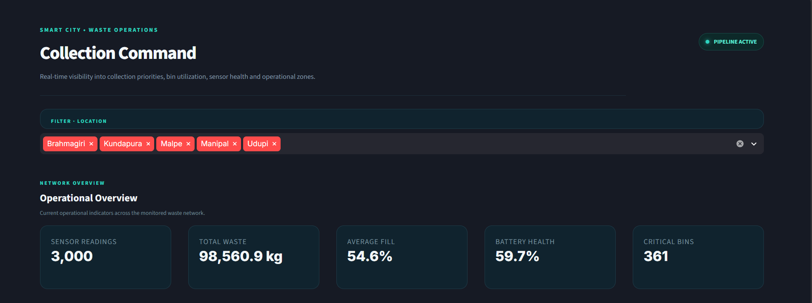
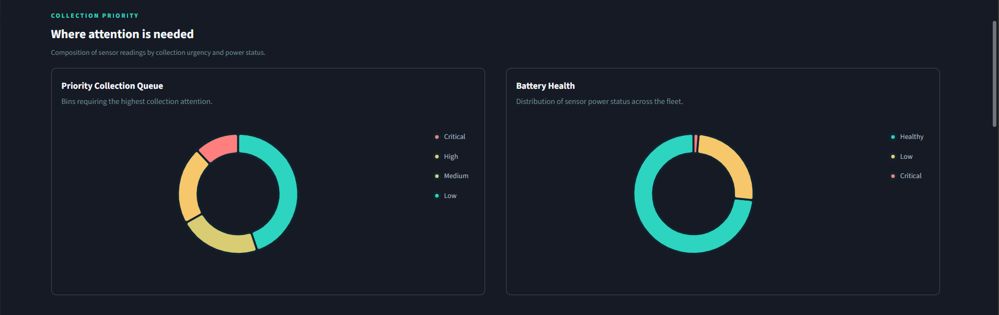
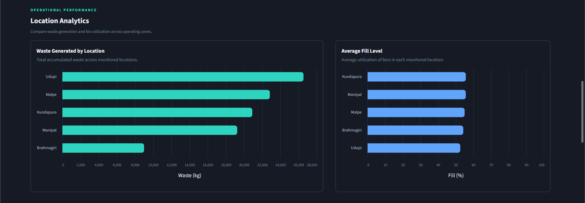
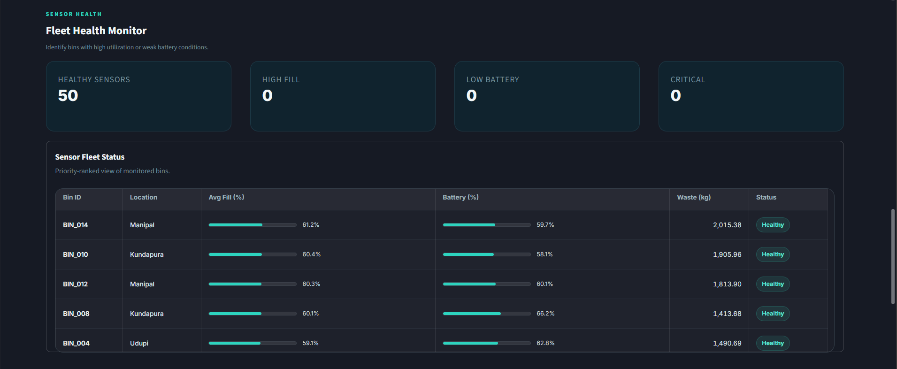
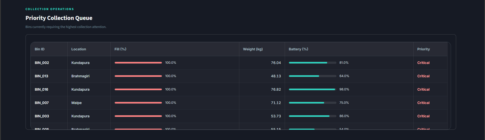
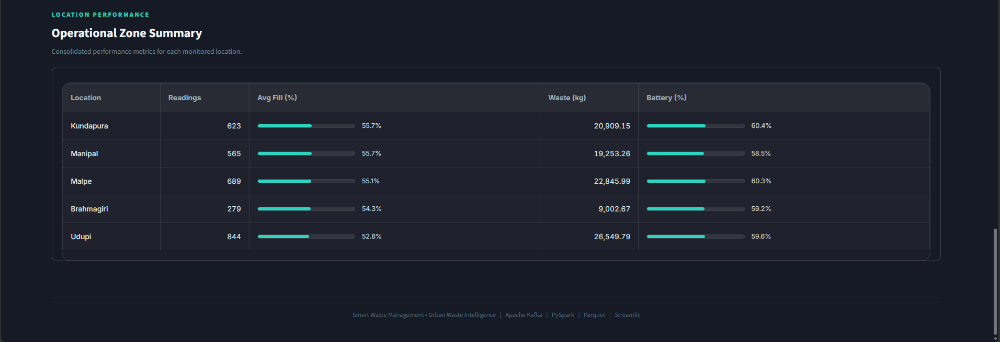

# Smart Waste Management – Real-Time Waste Collection & Data Engineering Pipeline

A real-time data engineering project that simulates smart waste-bin sensor data and processes it using Apache Kafka and PySpark Structured Streaming.

---

## Project Overview

The pipeline collects waste sensor events, streams them through Kafka, processes them using PySpark, stores the processed data in Parquet format, performs SQL-based analytics, and presents the results through an interactive Streamlit dashboard.

---

## Architecture

```text
Waste Sensor Data
       ↓
Python Kafka Producer
       ↓
Apache Kafka
       ↓
PySpark Structured Streaming
       ↓
Parquet Storage
       ↓
SQL Analytics
       ↓
Streamlit Dashboard
```

---

## Key Features

- Real-time waste sensor data generation
- Kafka-based event streaming
- PySpark Structured Streaming
- Parquet data storage
- SQL-based analytics
- Bin fill-level monitoring
- Battery health monitoring
- Collection priority identification
- Location-wise waste analysis
- Interactive Streamlit dashboard

---

## Technology Stack

- Python
- Apache Kafka 4.3.1
- PySpark 4.2.0
- Pandas
- SQL
- Parquet
- Streamlit
- Altair

---

## Dashboard

The dashboard provides insights into waste generation, bin utilization, sensor health, collection priorities, and location-wise operational performance.












---

## Project Structure

```text
smart-waste-data-engineering/
│
├── analytics/
│   └── waste_analysis.py
│
├── checkpoints/
│
├── dashboard/
│   └── app.py
│
├── data/
│   ├── raw/
│   │   └── waste_sensor_data.csv
│   │
│   └── processed/
│       └── analytics/
│
├── kafka/
│   └── kafka_config.md
│
├── producer/
│   └── waste_sensor_producer.py
│
├── spark/
│   ├── kafka_stream_test.py
│   └── waste_streaming.py
│
├── sql/
│   ├── analytics_queries.sql
│   └── run_analytics_sql.py
│
├── .gitignore
├── requirements.txt
└── README.md
```

---

## Running the Dashboard

```powershell
streamlit run dashboard\app.py
```

---

## Kafka Configuration

For Kafka setup, topic configuration, and streaming commands:

[kafka/kafka_config.md](kafka/kafka_config.md)
